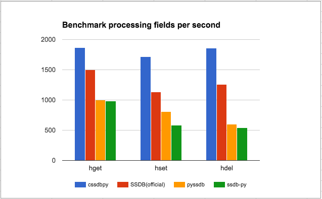

cssdbpy
------

.. image:: https://img.shields.io/pypi/v/cssdbpy.svg?maxAge=2592000?style=flat
        :target: https://pypi.python.org/pypi/cssdbpy/
        
.. image:: https://img.shields.io/pypi/l/cssdbpy.svg?maxAge=2592000?style=flat
        :target: https://pypi.python.org/pypi/cssdbpy/
        
.. image:: https://img.shields.io/badge/python-2.x-yellow.svg
        :target: https://pypi.python.org/pypi/cssdbpy/
        
.. image:: https://img.shields.io/badge/python-3.x-orange.svg
        :target: https://pypi.python.org/pypi/cssdbpy/

| Cssdbpy is a simple SSDB client written on Cython. Faster standard SSDB client. 
| SSDB a high performance NoSQL database supporting many data structures, an alternative to Redis. http://ssdb.io/

Install
-------

.. code-block:: bash

   pip install cssdbpy

or

.. code-block:: bash

   pip install https://github.com/deslum/cssdbpy/archive/master.zip

Example
-------
.. code-block:: python

   from cssdbpy import Connection
   from time import time
   import md5

   if __name__ == '__main__':
      conn = Connection('127.0.0.1', 8888)
      for i in xrange(0, 1000):
         md5word = md5.new('word{}'.format(i)).hexdigest()
         create = conn.execute('hset','words', md5word, int(time()))
         value = conn.execute('hget','words', md5word)
         exists = conn.execute('hexists','words', md5word)
         delete = conn.execute('hdel','words', md5word)
         print md5word, value, create, exists, delete
      print conn.execute('hscan', 'words', '', '', 100)
      conn.execute('hclear','words')

Documentation
-------------
http://cssdbpy.readthedocs.io/en/master/

Benchmark
-------------

MacBook Pro 2012 2,5 GHz Intel Core i5 4 ГБ 1600 МГц DDR3
80000 key/value fields

