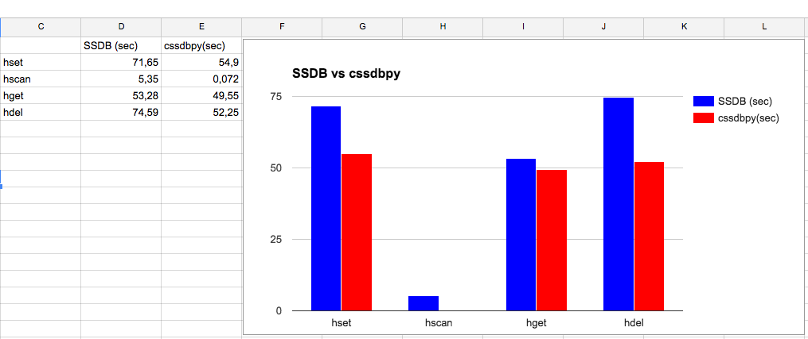

cssdbpy
------

.. image:: https://readthedocs.org/projects/ssdbpy/badge/?version=master

cssdbpy is a simple SSDB client written on Cython. Faster standart SSDB client.

Install
-------

.. code-block:: bash

   pip install cssdbpy

or

.. code-block:: bash

   pip install https://github.com/deslum/cssdbpy/archive/master.zip

Example
-------
.. code-block:: python

   from cssdbpy import Connection
   from time import time
   import md5
   
   if __name__ == '__main__':
      conn = Connection('127.0.0.1', 8888)
      for i in xrange(0, 1000):
         md5word = md5.new('word{}'.format(i)).hexdigest()
         create = conn.execute('hset','words', md5word, int(time()))
         value = conn.execute('hget','words', md5word)
         exists = conn.execute('hexists','words', md5word)
         delete = conn.execute('hdel','words', md5word)
         print md5word, value, create, exists, delete
      print conn.execute('hscan', 'words', '', '', 100)
      conn.execute('hclear','words')

Documentation
-------------
http://cssdbpy.readthedocs.io/en/master/

Benchmark
-------------

MacBook Pro 2012 2,5 GHz Intel Core i5 4 ГБ 1600 МГц DDR3
80000 key/value fields

